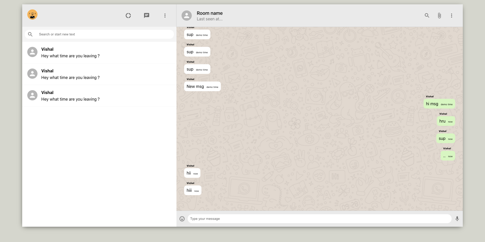

# WhatsApp-Clone
This is a whatsapp clone built using MERN stack. 



## Features
- This uses Pusher (alternate to sockets.io) to provide realtime messages
- It also has material UI


## Installation & set up

This installs the npm packages

``` 
npm i
```

This starts the frontend

```
npm run start
```

This starts the backend

```
nodemon server.js
```

